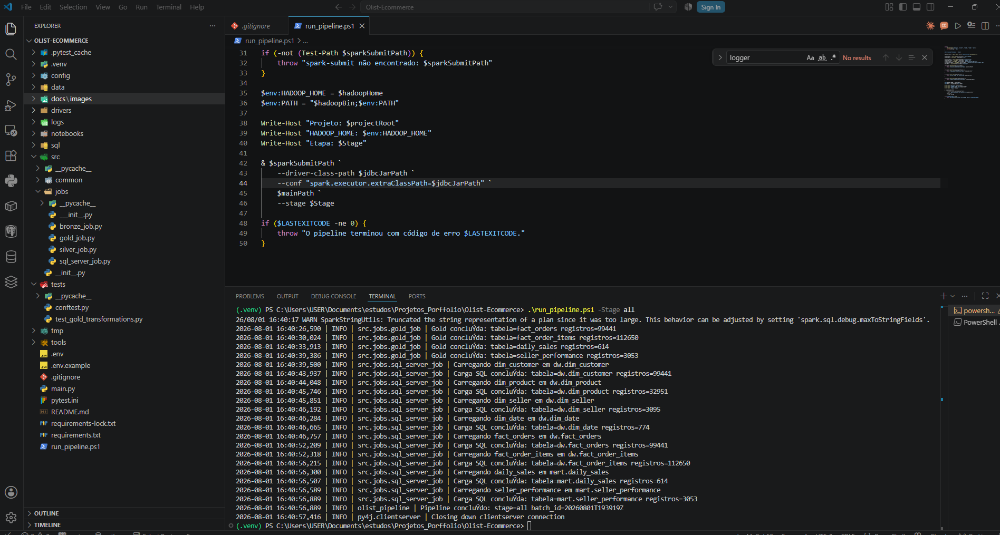
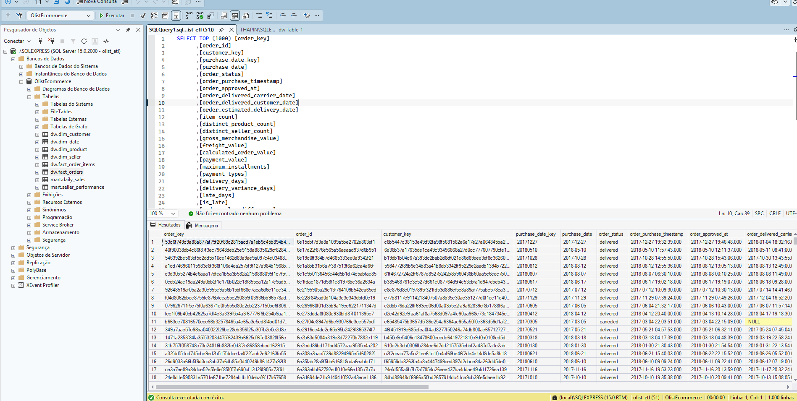

# Olist E-Commerce Data Platform

Pipeline de dados desenvolvido com PySpark para processar dados públicos de comércio eletrônico da Olist.

O projeto utiliza arquitetura medalhão, armazenamento em Parquet e integração com SQL Server.

> Projeto de portfólio sem vínculo oficial com a Olist.

## Arquitetura

```text
Arquivos CSV
    ↓
Bronze - dados brutos
    ↓
Silver - dados limpos e tipados
    ↓
Gold - modelo analítico
    ↓
SQL Server
```

## Tecnologias

- Python
- PySpark
- Spark SQL
- Parquet
- SQL Server
- JDBC
- Pytest
- Jupyter Notebook
- Git

## Dataset

Foi utilizado o Brazilian E-Commerce Public Dataset by Olist, disponível no Kaggle.

Arquivos utilizados:

- clientes
- pedidos
- itens dos pedidos
- pagamentos
- produtos
- vendedores
- tradução das categorias

Os arquivos CSV devem ser colocados dentro de:

```text
data/raw/
```

## Camadas de dados

### Bronze

Mantém os dados próximos do formato original e adiciona informações de auditoria, como horário da ingestão, arquivo de origem e identificador da execução.

### Silver

Responsável por:

- conversão de tipos
- padronização dos textos
- tratamento de datas
- remoção de duplicidades
- validação de valores nulos
- validação de valores monetários
- tradução das categorias de produtos

### Gold

Contém dimensões, fatos e tabelas agregadas para análise.

Tabelas criadas:

```text
dim_customer
dim_product
dim_seller
dim_date
fact_orders
fact_order_items
daily_sales
seller_performance
```

## Estrutura do projeto

```text
Olist-Ecommerce/
├── config/
├── data/
│   ├── raw/
│   └── lake/
│       ├── bronze/
│       ├── silver/
│       └── gold/
├── docs/
├── drivers/
├── notebooks/
├── sql/
├── src/
│   ├── common/
│   └── jobs/
├── tests/
├── main.py
├── run_pipeline.ps1
└── requirements.txt
```

## Configuração

### 1. Criar o ambiente virtual

```powershell
python -m venv .venv
.\.venv\Scripts\Activate.ps1
```

### 2. Instalar as dependências

```powershell
python -m pip install -r requirements.txt
```

### 3. Configurar o SQL Server

Execute o script:

```text
sql/00_create_database.sql
```

Depois, crie o arquivo `.env` com base no `.env.example`:

```env
SQL_SERVER_HOST=localhost
SQL_SERVER_PORT=1433
SQL_SERVER_DATABASE=OlistEcommerce
SQL_SERVER_USER=olist_etl
SQL_SERVER_PASSWORD=sua_senha
```

### 4. Executar o pipeline

```powershell
.\run_pipeline.ps1 -Stage all
```

Também é possível executar cada etapa separadamente:

```powershell
.\run_pipeline.ps1 -Stage bronze
.\run_pipeline.ps1 -Stage silver
.\run_pipeline.ps1 -Stage gold
.\run_pipeline.ps1 -Stage load
```

## Testes

```powershell
python -m pytest -v
```

## Resultados da carga

| Tabela | Registros |
|---|---:|
| `dw.dim_customer` | 99.441 |
| `dw.dim_product` | 32.951 |
| `dw.dim_seller` | 3.095 |
| `dw.dim_date` | 774 |
| `dw.fact_orders` | 99.441 |
| `dw.fact_order_items` | 112.650 |
| `mart.daily_sales` | 614 |
| `mart.seller_performance` | 3.053 |

## Execução

### Pipeline completo



### Dados carregados no SQL Server


## Limitações

- O pipeline utiliza carga completa.
- A execução foi desenvolvida para ambiente local Windows.
- O dataset é histórico e estático.
- O projeto ainda não possui um orquestrador externo.

## Próximos passos

- Migrar o pipeline para Databricks
- Utilizar Delta Lake
- Implementar carga incremental
- Criar dashboard no Power BI

## Autor

**SEU NOME**

- LinkedIn: https://www.linkedin.com/in/thais-piinheiro/
- GitHub: https://github.com/tthaispinheiro
